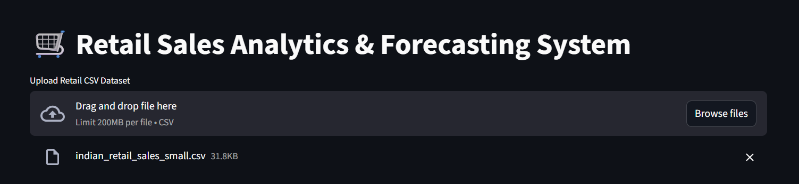
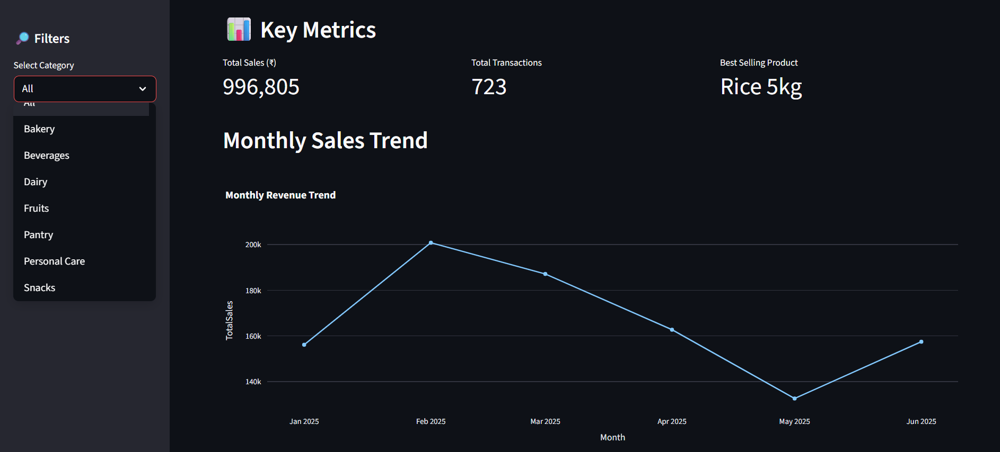
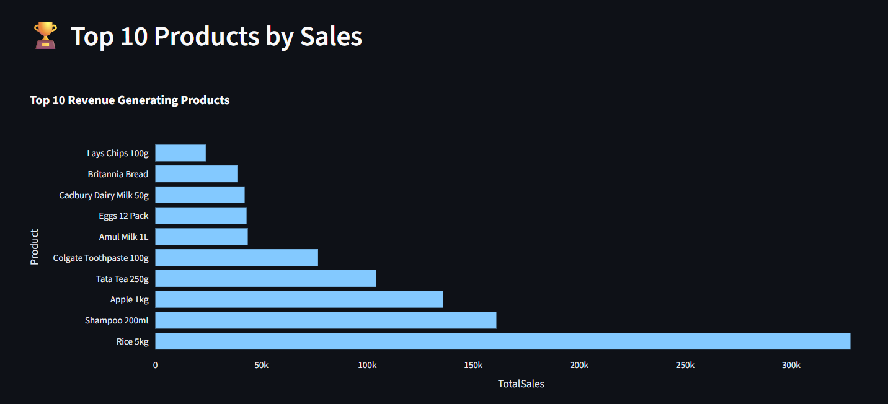
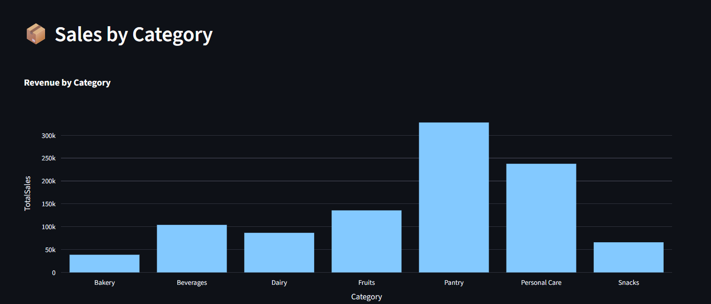
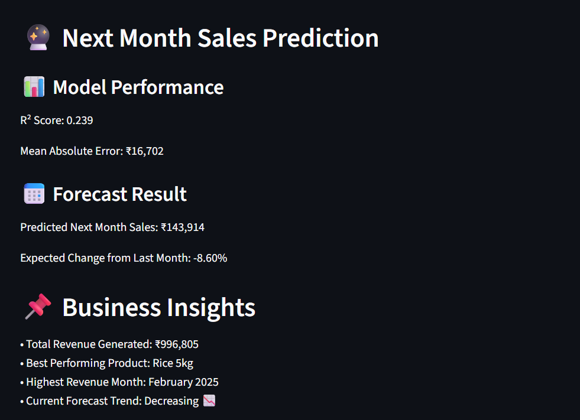

# Retail-Sales-Analytics-Dashboard
Interactive Retail Sales Analytics &amp; Forecasting Dashboard built with Streamlit, Pandas, Plotly and Scikit-learn.

## Project Overview:

An interactive retail analytics dashboard built using Streamlit, Pandas, and Plotly. 
The system analyzes sales trends, product performance, and category revenue, 
and predicts next month’s sales using Linear Regression.

## Key Features:

- KPI metrics [Key performance indicators : Total Sales, Transactions, Best product]
- Monthly revenue trend visualisation
- Top 10 products by revenue they generated
- Category-wise performannce
- Next-month sales forecasting
- Model evaluation {useing R^2 Score and MAE}

## Python Libraries Used:

- Streamlit : Creating and visualizing the dashboard
- Pandas : Analysis, cleaning, ingestion and manipulation of data
- Plotly : Visualization of data via interactable graphs [Matplotlib and seaborn were used in previous versions]
- Sckit-Learn : Machine learning and data forecasting

## Screenshots:

## To be added soon:
- YoY comparision
- Confidence interval
- Visualization of forecast v/s historical trend
  
